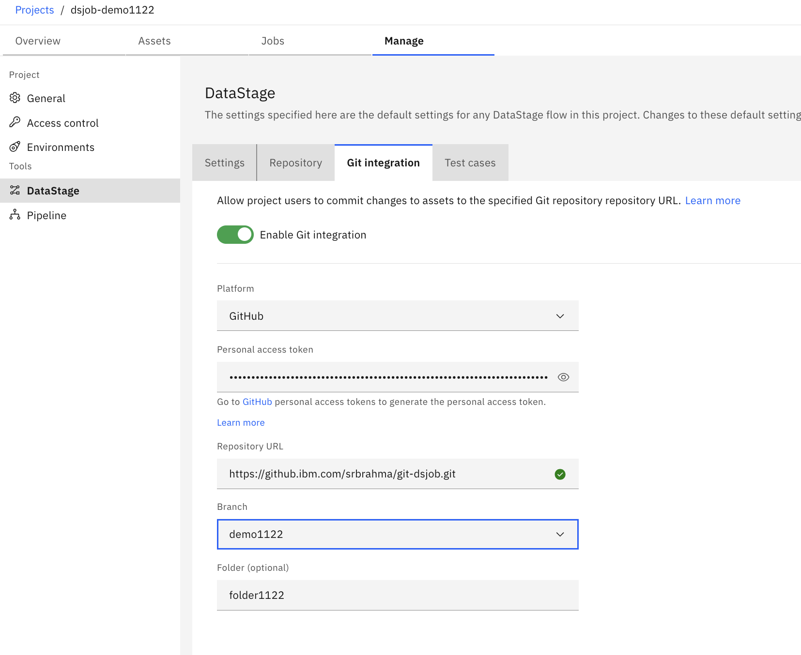
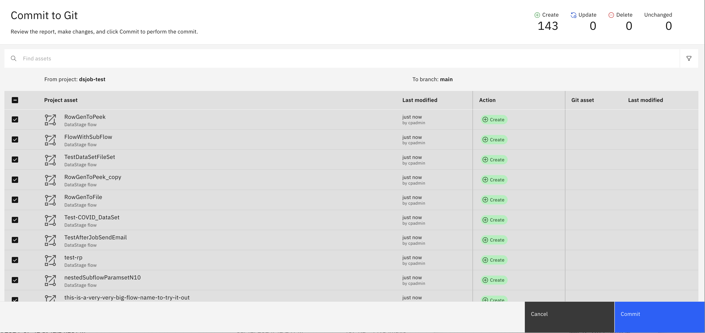

# Git Integration

Git Integration is a mechanism to write your project contents to a Git repository and maintain version control and integrate with your CI/CD pipelines.

DataStage customers would like to use Git as means for version control their project assets in Cloud Pak Projects. It will also help them promote their Development work into higher environments by integrating Git into their CI/CD process.

DataStage implements Git Integration as part of ds-migration service. Currently ds-migration service hosts all export and import functionality for the projects. New APIs are added to the ds-migration service to allow users to commit and pull their work from git using the existing export and import functionalities.

Before invoking the API, projects need to be Git enabled. This will setup initial configuration for the project and can be overridden by individual operations to Git.
This functionality will allow you to update incremental changes from your project where you collaborate and build functionality and sync to your Git repo. It is then possible to promote your tested projects to higher environments such as QA and eventually to Production.

Git Integration provides three commands:
- `git-commit`: Allow CPD Project resources to push and commit to Git repository
- `git-pull`: Allow project artifacts from Git repository to pull and update into CPD Projects
- `git-status`: Provides status on resource to identify the differences between the CPD Project and the Git repository

A bit of background...
- Git Integration is also available before 5.x releases and was implemented as a CLI side functionality. It did not require user to configure the projects with Git Integration.
- CLI tooling has limitations and other scalability issues. We now have Git Integration implemented into the DataStage Migration service. This now requires additional steps to configure.
- Git repositories used before 5.x releases are still backward compatible

#### Setting Up GitHub 
1. Go to GitHub.com
2. Login to GitHub
b. If you do not have an account, Sign Up and create an account to get
started
3. Go to the Git Repository you want to connect to your DataStage project
c. If you do not have a Git Repository you want to use, create a new
repository by clicking “New”
d. Enter a name, select private or public
e. For other options, fill at your discretion
4. Once you have a repository, go to the Repository. Ensure you have a branch that
you want to use. Every repository will have a default branch called “main”
f. NOTE: make sure to keep this URL handy as this will be used in DataStage
to establish the connection. Make sure you grab the URL without the
branch addition at the end of the URL and make sure “.git” is also
appended.
5. In the top right corner of GitHub, click your profile name and go to settings > Developer settings > Personal access tokens > Fine-grained tokens OR Tokens (Classic) 
a. Either Classic or Fine-grained tokens will work to establish the connection to GitHub. 
6. Click Generate New Token 
a. Fill in the required fields and configure the optional fields. 
7. Copy your token details and make sure to save it. You will not be able to view the token again after you leave the page. 

#### Setting up Git Integration for the project
To allow your project to be aware of Git Inegration, we need to setup and enable change tracking of all resources in the project. This requires users to explicitly configure the project for Git Integration using the following command.
```
cpdctl dsjob git-configure {--project PROJECT | --project-id PROJID} [--git-enable] [--git-url URL] [--git-owner OWNER] [--git-token TOKEN] [--git-org ORG] [--git-email EMAIL] [--git-provider GITPROVIDER]  [--git-branch GITBRANCH]  [--git-folder GITFOLDER]
``` 
-  `project`  is the name of the project.
-  `project-id`  is the id of the project. One of  `project`  or  `project-id`  must be specified.
-  `git-enable` allows project to be git enabled and starts tracking resource changes
-  `git-url`  git repo url. ex: `https://github.company.com/username/git-dsjob.git`
-  `git-owner`  owner of the git repository ex: `username`. This field is optional.
-  `git-token`  token used for authentication. This field is encrypted when stored.
-  `git-org`   Git organization, this field is optional. 
-  `git-provider` Integrate to specific provider, must be `git` or `gitlab` currently.
-  `git-branch` Default branch used for git operations
-  `git-folder` Folder to which this project will be committed or fetched from. This is optional

Git URL is the destination of your organizations git URL. Git owner is the user who commits to Git and the Git token is the user’s token used for auth. Fields `git-owner`, `git-org` are deducible to the URL and can be removed from the command eventually. 
Currently git is configurable with Auth Token but will support SSL certs in the future. Also we only support https enabled repositories in this release.

Git can also be configured from the UI.



Once git is configured, Migration service starts collecting data on all assets that are added, modified or deleted so that we tally these assets to allow user to accurately get status on the CPD Project against Git repo. This will consume some cluster resource and can be managed using the [tracking](https://github.com/IBM/DataStage/blob/main/dsjob/dsjob.5.1.0.md#managing-git-project-tracking-data) api to turn it on when needed.

Use the provided [git-operations](https://github.com/IBM/DataStage/blob/main/dsjob/dsjob.5.1.0.md#git-integration) to integrate your CPD project with Git.

#### Git Commit
This Api allows users to commit their project as a whole or incrementally into Git. When a project is committed to Git, it maintains a specific structure of this project in Git.

Each action is a single signed commit.
Commit takes assets from project and writes to Git repo under a branch and a folder. User must make sure that each project is maintained into a separate folder to make sure that project data is not overlapped.

Commit can be invoked from UI as shown by pressing the Sync button. 


User will have chance to select assets to commit or can commit the entire project.



User will be prompted to enter commit message


Once committed to git the repo structure would look like below. This repo `git-dsjob` has two projects under the branch `dsjob101`. Each project is committed to its own folder `dsjob-test` and `dsjob101` respectively.


Assets of each type are assigned to their respective folders. All parameter sets are shown below are stored as json types. Some assets are stored in binary form.


Context based commits are available from UI from assets page or by right clicking on an asset.


The commit is based on the structure of the DataStage export API. Each asset is stored into a folder designated by its type. For example, all flows are stored as Json files under `data_intg_flow`. Files are named after asset names.
Git commit also maintains and updates `  DataStage-README.json` at the root of the folder with a manifest of all assets it operated on. Also, Git commit writes `DataStage-DirectoryAsset.json` into repo as is to restore folder structure when this project from the repository is imported back into CloudPak project.
Note `project.json` is a special file that is added at the root of each folder and maintained by Git API. This file will help determine project level changes with respect to Git. This file along side the project tracking data in the Migration service helps in determining what assets are changed between Project and Git.


#### Git Commit from CLI
```
$ cpdctl dsjob git-commit -p dsjob-demo1122 --repo git-dsjob --branch demo1122 --in-folder folder1122 --commit-message "test commit" --wait 2000
...
status   in_progress
2025-02-19 11:28:29: Project export status: in_progress, total: 49, completed: 22, failed: 0.
2025-02-19 11:28:39: Project export status: in_progress, total: 49, completed: 49, failed: 0.
2025-02-19 11:28:49: Project export status: in_progress, total: 49, completed: 49, failed: 0.
2025-02-19 11:28:59: Project export status: completed, total: 49, completed: 49, failed: 0.
{
  "metadata": {
    "url": "https://cpd-ds.apps.clusterid.com/data_intg/v3/migration/export_flows_status?project_id=7a1d2ad1-5a1c-4216-9ddc-5edcb22af077",
    "project_id": "7a1d2ad1-5a1c-4216-9ddc-5edcb22af077",
    "project_name": "dsjob-demo1122",
    "created_at": "2025-02-19T19:28:19.126Z",
    "created_by": "cpadmin"
  },
  "entity": {
    "status": "completed",
    "start_time": "2025-02-19T19:28:19.148Z",
    "end_time": "2025-02-19T19:28:53.065Z",
    "elapsed_time": 33,
    "failed_flows": [
      {
        "end_time": "2025-02-19T19:28:20.379Z",
        "errors": [
          {
            "description": "DSMIG0013W : Data connection `test_StorageVolume` is missing.",
            "name": "test_sequenceFlow_waitForFile_storagevolume_connection",
            "type": "flow_export_error"
          }
        ],
        "id": "1ef16a5e-de72-4b5a-ad20-40432c871e59",
        "name": "test_sequenceFlow_waitForFile_storagevolume_connection",
        "status": "completed_with_error",
        "type": "sequence_job"
      }
    ],
    "tally": {
      "total": 49,
      "completed": 49,
      "skipped": 0,
      "failed": 0,
      "sequence_jobs_total": 10,
      "parallel_jobs_total": 13,
      "sequence_job_export_completed": 10,
      "parallel_jobs_export_completed": 13,
      "sequence_job_export_failed": 0,
      "parallel_jobs_export_failed": 0,
      "connections_total": 3,
      "parameter_sets_total": 6,
      "table_definitions_total": 7,
      "subflows_total": 0,
      "routines_total": 0,
      "message_handlers_total": 7,
      "build_stages_total": 0,
      "custom_stages_total": 0,
      "wrapped_stages_total": 0,
      "xml_schema_libraries_total": 1,
      "function_libraries_total": 0,
      "java_libraries_total": 0,
      "odm_libraries_total": 0,
      "match_spec_total": 0,
      "rule_set_total": 0,
      "data_quality_spec_total": 0,
      "data_quality_rules_total": 0,
      "data_quality_definitions_total": 0,
      "data_assets_total": 0,
      "data_sets_total": 1,
      "file_sets_total": 1,
      "odbc_configuration_total": 0,
      "cff_schemas_total": 0,
      "test_cases_total": 0
    }
  },
  "gitcommit": {
    "fetch_status": "completed",
    "repo": "git-dsjob",
    "branch": "demo1122",
    "folder": "folder1122",
    "commitmessage": "test commit",
    "commit_sha": "d90fe805397026f57f7eb40df60df4d24ef64f4e"
  }
}

Status code =  0
```
Incremental commit can be achieved using the git-commit command, it will commit the flows/pipelines with dependencies unless specified. Following example shows incremental commit of a flow and paramete set.
```
$ cpdctl dsjob git-commit -p dsjob-demo1122 --repo git-dsjob --branch demo1122 --in-folder folder1122 --name data_intg_flow/TestDataSetFileSet --name parameter_set/pset22  --commit-message "test commit2" --wait 2000
```

This results in a PR depending on how you configured your repository.


#### Git Pull
This Api allows users to pull their Git project as a whole or incrementally of the picked assets from Git repository into CloudPak Project. Git pull is backed by ds-migration import service. Apart from specifying repo, branch and folder user can control which assets can be replaced, skipped when promoting to higher environment using conflict resolution, hard-replace and skip-on-replace switches.

Pull can be invoked from UI as shown:


User will have chance to select assets to pul or can pull the entire project form repository. Not that the source of truth changes and hence the object that are in the 


Context based pull are available from UI on selected assets.


#### Git Pull from CLI
Create a project
```
$ cpdctl dsjob create-project -n dsjob-pulltest
470b2e48-b94f-4643-a14d-86f1f064859b
```
Configure the project
```
$ cpdctl dsjob git-configure -p dsjob-pulltest --git-enable --git-url https://github.aaa.com/user/git-dsjob.git  --git-provider git  --git-token XXXXX 
```
Now pull the committed repository into the new project
```
$ cpdctl dsjob git-pull -p dsjob-pulltest --repo git-dsjob --branch demo1122 --in-folder folder1122  --wait 200
...
2025-02-19 12:27:17: Waiting until import finishes, import id: 4f21c557-ddbc-40e9-bb2e-0b4235df1046
2025-02-19 12:27:27: Project import status: started,  total: 51, completed: 4, failed: 0, skipped: 0.
2025-02-19 12:27:47: Project import status: started,  total: 51, completed: 32, failed: 0, skipped: 0.
2025-02-19 12:28:08: Project import status: started,  total: 51, completed: 44, failed: 0, skipped: 0.
2025-02-19 12:28:17: Project import status: started,  total: 51, completed: 45, failed: 0, skipped: 0.
2025-02-19 12:28:38: Project import status: completed,  total: 51, completed: 51, failed: 0, skipped: 0.

Status code =  0
```

#### Git Status
Git Integration provides platform specific computations to determine if the resource in Git repository is same as the resource in CloudPak Project.

Status is displayed which is context based, during commit the source of truth is the project which means `created` refers to a resource in project but not in Git repository and vice versa. Object that are modified in the Project are shown as `updated`. During pull the source of truth comes from Git repository, a `created` object is an object that exists in Git repository and is ready to be pulled and created in the Project. 


#### Git status from cli
```
$ cpdctl dsjob git-status -p dsjob-pulltest --repo git-dsjob --branch demo1122 --in-folder folder1122
...

Project Changes:

  data_intg_message_handler:
	TestMsgH1(48f69aa0-d54c-4bf3-8d75-c39f22633ecc)
	TestMsgH1_Import_1724177183930(e0f7d87d-738f-4ebb-a933-f891a4ac5603)
	TestMsgH2(25198c63-6adb-4328-bdf0-87c5fdc79a72)
	TestMsgH2_Import_1724177183928(3bd6ce40-524e-48bd-8799-d287c0be6f2d)
	TestMsgHandler(40f9cf92-659f-460f-8b69-1d591376b271)
	TestMsgHandler2(716bbb91-52ca-44ae-894a-3f9b192e8fe2)
	TestMsgHandler2_Import_1724177187002(c2c05a51-1741-44b7-a74d-f04357bea33b)
	TestMsgHandler_Import_1724177189960(1599abdd-369d-417d-b63f-a0c7709883c8)

  orchestration_flow:
	TestPipeline_Run_Twice(720b0364-f691-4257-b145-de9aecb819b7)
	SequenceFlow_userVariables_TimestampToDate_expression(7d0099ca-d19c-4488-95fa-3f52ebc53ba9)
	testParams(908cbfcc-d28e-4d59-ab8d-3ae064379aa4)
    ...
```

### Working with proxy

When proxy is used, we need a environment vairable GIT_HTTP_PROXY set to the proxy url for connecting to Git from inside migration service. To achieve this we need to edit datastage customer resource to add a property with the end point. 

``` 
// Edit DataStage CR
oc edit datastge datastage

// under spec add property gitHTTPSProxy with proper URL for the proxy as shown below.
  uid: adf2528c-1451-41b6-b2e2-4e10da2c2559
spec:
  ds_enterprise: false
  ds_set_runtime_class: false
  enableDataService: true
  enableFlowsAssistant: false
  enableMetrics: true
  enableODLM: false
  gitHTTPSProxy: http://9.xx.xxx.xxx:3128        <======
  ignoreForMaintenance: false
```
after the CR is saved, DataStage operator will eventually process it and restarts the migration service pod with proper environment variable. You can check the setting using the following command
```
# oc rsh datastage-ibm-datastage-migration-687ff87c45-4tdrg env |grep GIT_HTTP
GIT_HTTPS_PROXY=http://9.52.244.237:32336
```

Now you are ready to use your proxy. 
For trouble shooting the connection, please check configuration required in proxy to allow connection from your custer and also ability for proxy to connect to github.


Currently this functionality is available only on CPD platforms and we are working in bring it to Saas soon.
