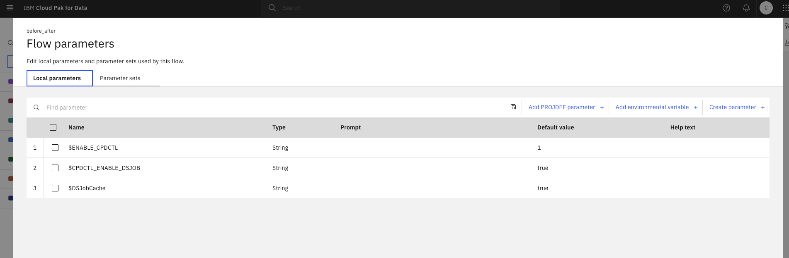
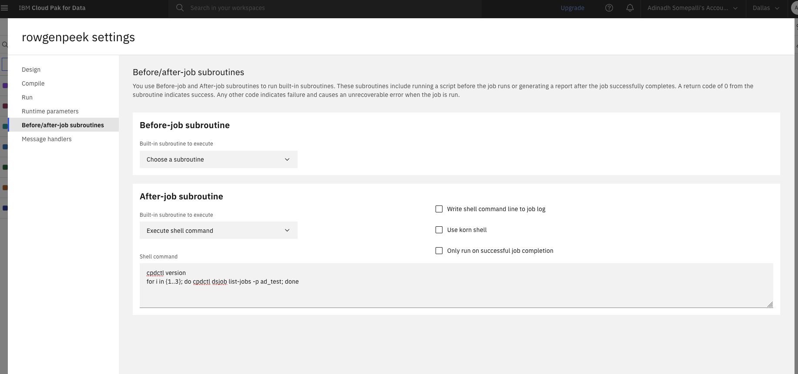
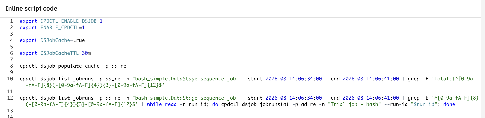
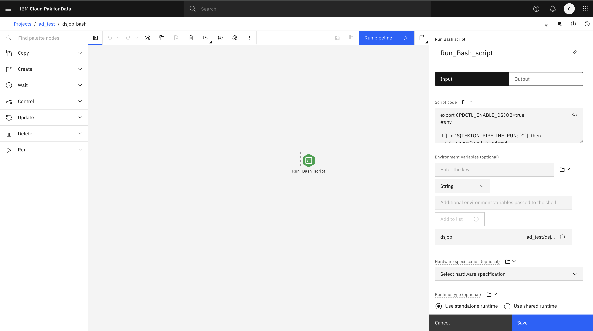
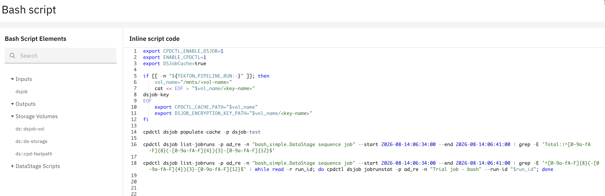

# Why caching for dsjob
dsjob plugin will provide its own caching mechanism to write the fetched get api calls data into a local file. On subsequent calls we try to read the cached data in the local file to match the request and avoid making a backend call to fetch this data.
As an example, if customer runs the below command, we fetch projectID and use it in getting list of jobs.
` cpdctl dsjob list-jobs --project myProject` 
The relevant information from `myproject` such as project ID are writtent to local file
When next call such as below happend we look into the existing local file to match the project and get the ID instead of going to invoke backend api to fetch projectID. 
`cpdctl dsjob run --project myProject --name myJob`

# Configuring cache for dsjob
## Step 1: Set cache file path
Set environment variable in your script to provide cache path. Make sure the user running cpdctl has write access to the directory. All the cache files will be written to this directory.
```bash
export CPDCTL_CACHE_PATH=/my/path/cache
```

## Step 2: Set encryption key path
Create a file named mykey.txt and put your encryption key in it. For example: `this is my secure key passphrase`. Then set `DSJOB_ENCRYPTION_KEY_PATH` to that file path.
```bash
export DSJOB_ENCRYPTION_KEY_PATH=~/dsjob/mykey.txt
```

## Step 3: Enable cache
Set the environment variable `DSJobCache` to `true` to enable cache. Default is `false`.
```bash
export DSJobCache=true
```

### Step 3.1: Optional - set cache expiration time
This is optional. Default DSJobCacheTTL is 10 minutes. You can change it to any value you want. This is the time after which the cache will expire.
```bash
export DSJobCacheTTL=24h      # 24 hours
export DSJobCacheTTL=2h30m    # 2 hours 30 minutes
```

## Step 4: Run a dsjob command
Now you can run a dsjob command. Fetched data will be written to cache.

Run a dsjob command, for example:
```bash
time cpdctl dsjob list-jobs -p myProj
```
### Step 4.1: Check the cache file
Go to the directory set in `CPDCTL_CACHE_PATH`. You should see a cache file there.
```bash
$ ls -l
-rw-r--r--@ 1 user1  staff  43792 Apr 8 10:08 U:1000331001-H:190e6ef1638cc6c131fc45ffb27bf825-jobs.cache
```

After the cache file is created, run the same command again. This time, dsjob will try to use the cache.

Note: If you cannot find the cache file, please verify that steps 1 to 3 are completed.

## step 5: Populate cache
This is optional but highly recommended because it creates all supported cache files for that project. If you want to pre-populate cache for a specific project, use:

```bash
cpdctl dsjob populate-cache -p myProj
```

Go to the directory set in `CPDCTL_CACHE_PATH`. You should see cache files there.

```bash
$ ls -l

-rw-r--r--@ 1 user1  staff  43792 Apr 8 17:29 U:1000331001-H:0a1facd4bd41effe1d130d2a326b5b7e-projects.cache
-rw-r--r--@ 1 user1  staff  2524 Apr  8 17:29 U:1000331001-H:db226dffb23efdf19d9b9293f9d40f74-flows.cache
-rw-r--r--@ 1 user1  staff  4252 Apr  8 17:29 U:1000331001-H:db226dffb23efdf19d9b9293f9d40f74-jobs.cache
-rw-r--r--@ 1 user1  staff   612 Apr  8 17:29 U:1000331001-H:db226dffb23efdf19d9b9293f9d40f74-pipelines.cache
```

After these cache files are created, later commands can reuse them.

### step 5.1: Clear cache
If you want to clear cache and fetch fresh data from backend again, use:
```bash
cpdctl dsjob clear-cache -p myProj
```
The matching cache files for that project will be deleted.

# Cache scope

Our cache feature is designed in such a way to work across different users in a single project. Cache file name is hashed with user id, project id and cluster url(doesn't include project id for projects cache file). This ensures that each user will have their own cache file and data will not be mixed up. Also all the cached info stays in your local directory that you specify as the `CPDCTL_CACHE_PATH`. 

Once we have all these environment variable set, local caching is enabled and the cache data is written to disk. This can make subsequent call faster and also avoid rate limit issues. 
Note that is this a incremental approach and more calls will be planned to use caching in future releases of cpdctl.

Currently, cache is enabled for four areas, projects, jobs, flows and pipelines. All the four lists and name/id retrievals are cached.

# Commands added

We added two commands, one to populate cache and one to clear cache.

`Populate cache:`

Command usage:

cpdctl dsjob populate-cache {{--project PROJECT | --project-id PROJID} | {--space SPACE | --space-id SPACEID}} [--skip-jobs] [--skip-projects] [--skip-pipelines] [--skip-flows]

This command needs the user to provide project id/name and populates all the jobs, flows, pipelines cache files for the specified project. Irrepective of the provided project, entire projects list will be populated.

Running this command before using the cache is highly recommended as it gets all the information for the given project and reduces the number of subsequent API calls. Cache works without running this command, but not as significant as pre populating all the cache at the start with this command. If the cache is already present, this command clear it and gets and populates the latest information from the backend.

You can use the skip flags if you want to skip the populate cache for a particular category. Multiple skip options can be used in a single command. example: if `cpdctl dsjob populate-cache --project myProj --skip-pipelines --skip-flows` are used then cache will not be populated for pipelines and flows

One thing to note is, even if we do not run this command, cache works fine. But it is highly recommended to run this command before using the cache as this gets all the information for the given project and reduces the number of subsequent API calls.

Note: Any changes from UI will not be reflected once cache is populated and not cleared.

`Clear cache:`

Command usage:

cpdctl dsjob clear-cache {{--project PROJECT | --project-id PROJID} | {--space SPACE | --space-id SPACEID}} [--skip-jobs] [--skip-projects] [--skip-pipelines] [--skip-flows]

This command needs the user to provide project id/name and clears all the four cache files for the given project. Irrepective of the provided project id/name, entire projects list will be cleared and jobs, flows, pipelines information of the provided project will be cleared.

You can use the skip flags if you want to skip the clear cache for a particular category. Multiple skip options can be used in a single command. example: if `cpdctl dsjob clear-cache --project myProj --skip-jobs --skip-flows` are used, then cache will not be cleared for jobs and flows

If there are any updates from UI or if you want to clear the cache, this command can be used.

# How caching works

example 1:

First call(if populate-cache was not run before):

cpdctl dsjob list-jobs --project myProject

what happens:

1. checks whether matching cache exists for the given project.
2. if cache is not found, continue with normal backend API calls and Fetch required data.
3. Write fetched data into local cache file and returns the fetched data.

Next call:

same cpdctl dsjob list-jobs --project myProject

what happens:

1. checks whether matching cache exists for the given project.
2. if valid cache is found, reuses cached lookup data and avoids extra backend lookup calls.
3. Return command output faster

example 2:

If populate-cache is ran before:

cpdctl dsjob list-jobs --project myProject

what happens:
1. checks whether matching cache exists for the given project and given job.
2. if valid cache is found, reuses cached lookup data and avoids extra backend lookup calls.
3. Return command output faster

example 3:

First call(if populate-cache was not run before):

cpdctl dsjob run --project myProject --name myJob

what happens:

1. checks whether matching cache exists for the given project and given job.
2. if cache is not found, continue with normal backend API calls and Fetch required data.
3. In this case, it will only store name to id mapping into local cache file and returns the requested fetched data.

Next call:

1. checks whether matching cache exists for the given project and given job.
2. if valid cache is found, reuses cached lookup data.
3. In this case, it will get name to id mapping from local cache file and avoid backend call for that cached data.

example 4:

If populate-cache is ran before, all four lists and name to id mapping is cached:

what happens:

1. checks whether matching cache exists for the given project and given job.
2. if valid cache is found, reuses cached lookup data.
3. In this case, it will get name to id mapping from local cache file and avoid backend call for that cached data.


# Cache commands usage

`Projects Cache:`

caches the projects list, project id with name, get project name with id. Most of the dsjob commands uses project name/id retrieval and cache is used to get them and avoids rate limit issues.

`related commands:`

cpdctl dsjob commands those uses list-projects, get project id with name, get project name with id will be benefitted with projects cache. As most of the dsjob commands uses get project id with name and get project name with id, projects caching will be used. Few related commands are jobs, flows, pipelines commands along with projects commands like list-projects.

`example usage:`

example 1:

If we want to get list-jobs in a project

cpdctl dsjob list-jobs --project myProject

If cache is prepopulated, cache saves the api call to get the project id with and gets it from the cache.

example 2:

Initial call without cache:

time cpdctl dsjob list-projects
...

Total: 159 Projects

Status code = 0

`real	0m2.662s`

With cache:

time cpdctl dsjob list-projects
...

Total: 159 Projects

Status code = 0

`real	0m0.676s`

So projects cache mainly helps with list-projects, project name to project ID lookup and vice versa, repeated commands on same project.


`Jobs cache:`

caches the jobs list, job id with name, get job name with id. DSJob commands related to jobs uses job name/id retrieval and cache is used to get them and avoids rate limit issues.

`related commands:`

commands that uses list-jobs, get job id with name, get job name with id will be benefitted with jobs cache. As most of the dsjob commands realted to jobs uses get job id with name and get job name with id, jobs caching will be used. Few related commands are get-job, delete-job, jobinfo, update-job , run.


`example usage:`

example 1:

if we want to run a job by, cpdctl dsjob run --project myProject --name myJob

Given the cache is prepopulated, cache saves the api call to get the job id with name and gets it from the cache.

example 2:

Initial call without cache:

time cpdctl dsjob list-jobs -p myProj
...

Total: 266 Jobs

Status code = 0

`real	0m3.714s`

With cache:

time cpdctl dsjob list-jobs -p myProj
...

Total: 266 Jobs

Status code = 0

`real	0m1.470s`

Jobs cache stores data in a way that supports list-jobs, get job id with name, get job name with id and avoids rate limit issues.


`Flows cache:`

Caches the flows list, flow id with name, get flow name with id will be benefitted with flows cache. DSJob commands related to flows uses flow name/id retrieval and cache is used to get them and avoids rate limit issues.

`related commands:`

commands that uses list-flows, get flow id with name, get flow name with id. As most of the dsjob commands realted to flows uses get flow id with name and get flow name with id, flows caching will be used. Few related commands are get-flow, delete-flow, update-flow.

example usage:

example 1:

If we want to get a flow with, cpdctl dsjob get-flow --project myProj --flow myFlow

Given the cache is prepopulated, cache saves the api call to get the flow id with name and gets it from the cache.

example 2:

Initial run without cache:

time cpdctl dsjob list-flows -p myProj
...

Total: 172 Flows

Status code = 0

`real	0m4.687s`

With cache:

time cpdctl dsjob list-flows -p myProj
...

Total: 172 Flows

Status code = 0

`real	0m1.249s`

Flows cache stores data in a way that supports list-flows, get flow id with name and get flow name with id.


`Pipeline cache:`

Cached the pipeline list, pipeline id with name. DSJob commands related to list-pipelines and get pipeline-id uses pipeline cache to get them and avoids rate limit issues.

`related commands:`

commands that uses list-pipelines, get pipeline id with name will be benefitted with pipelines cache. As most of the dsjob commands realted to flows uses get flow-id with name, flows caching will be used. Few related commands are get-pipeline, run-pipeline, delete-pipeline.

example usage:

example 1:

If we want to get a pipeline with, cpdctl dsjob run-pipeline --project myProj --pipeline myPipeline

Given the cache is prepopulated, cache saves the api call to get the pipeline id with name and gets it from the cache. If populate-cache command is not used, it will call the api to get the data and save it to the cache and will be used in subsequent calls.

example 2:

Initial run without cache:

time cpdctl dsjob list-pipelines -p myProj
...

Total: 47 Pipelines

Status code = 0

`real	0m2.370s`

With cache:

time cpdctl dsjob list-pipelines -p myProj
...

Total: 47 Pipelines

Status code = 0

`real	0m1.338s`

Pipelines cache stores data in a way that supports list-pipelines and get-pipeline-id with name.


# Summary:

DSJob caching stores frequently fetched data in local encrypted files so repeated commands can avoid unnecessary backend calls.

Current cache support covers:

1. projects - list-projects, other commands that corelated with project.
2. jobs - list-jobs, get-job-id with name, get-job-name with id.
3. flows - list-flows, get-flow-id with name, get-flow-name with id.
4. pipelines - get-pipelines, get-pipeline-id with name

To enable cache:

1. Set the environment variable `CPDCTL_CACHE_PATH` to the directory where you want to store the cache.
2. Set the environment variable `DSJOB_ENCRYPTION_KEY_PATH` to the path to the encryption key file.
3. set DSJob cache to true: `export DSJobCache=true`.
4. modify DSJobCacheTTL to modify the cache time to live(Default 10 minutes).
5. optional, but highly sugggested, Run `cpdctl dsjob populate-cache -p myProj` to populate the cache for that project.

The expected usage pattern is:

1. first call fetches and writes cache
2. later call reads cache and avoids backend call where possible
3. if cache cannot be used, normal backend logic continues


# Setting up dsjob cache when running from a Job Routine in a DataStage flow

The steps below apply to both **CPD (Cloud Pak for Data)** and **IBM Cloud** deployments.

## Step 0: Enable cpdctl commands in the flow (prerequisite)

This step is not directly related to cache setup, but it is **required** to run any `cpdctl` commands from a DataStage flow.

Set the `ENABLE_CPDCTL` variable in the flow's local parameters:

1. Open the flow UI page.
2. Go to **Add parameters → Create parameter**.
3. Enter the following values:

- Name: `$ENABLE_CPDCTL`
- Default value: `true`

Example:



## Step 1: Enable the DSJob cache

Set the `DSJobCache` variable in the flow's local parameters:

1. Open the flow UI page.
2. Go to **Add parameters → Create parameter**.
3. Enter the following values:

- Name: `$DSJobCache`
- Default value: `true`

## Step 2.1: Set cache expiration time (optional)

The default cache TTL is **10 minutes**. To override it, set the `DSJobCacheTTL` variable in the flow's local parameters:

1. Open the flow UI page.
2. Go to **Add parameters → Create parameter**.
3. Enter the following values:

- Name: `$DSJobCacheTTL`
- Default value: `30m`

You can use any valid duration string, for example `10m`, `1h`, or `2h30m`.

## Step 2.2: Run cpdctl commands inside a subroutine

You can add your `cpdctl` commands inside the job routine and run the flow. Once the flow runs, you will see your commands executing and the output in the job logs.



These steps cover the basic setup. Follow next steps if you want to run with a customized version instead of the built-in version. If you have all the changes that you need, in the built-in cloud/cpd cluster version, you don't need to follow the below steps.

## Replace cpdctl binary on DataStage Cloud with Remote Engine and CPD Cluster

Cloud with Remote Engine cache support is available starting with cpdctl version `1.8.260`.

### 1. Download and install the new binary

Download the appropriate Linux binary from the official cpdctl release. Confirm the architecture first:

```bash
uname -m
```

For `x86_64`, use `cpdctl_linux_amd64.tar.gz`. Extract the binary from it, copy it into the remote-engine container.

> 📁 **Example path:** `/tmp/cpdctl_custom`

### 2. Replace the existing symlink

You can also refer to this IBM document https://www.ibm.com/docs/en/ws-and-kc?topic=jobs-setting-up-before-job-after-job-subroutines to know more about replacing cpdctl

The existing path is a symlink:

```text
/px-storage/tools/cpdctl/cpdctl -> /opt/ibm/PXService/tools/cpdctl
```

Replace it with the new binary using `mv` — do not use plain `cp` while the destination is a symlink, as it may follow the link and attempt to overwrite the inaccessible `/opt/ibm/PXService/tools/cpdctl` binary:

```bash
mv <binary-path-inside-container> /px-storage/tools/cpdctl/cpdctl
```

> 📋 **Example:**
> ```bash
> mv /tmp/cpdctl_custom /px-storage/tools/cpdctl/cpdctl
> ```

Verify the replacement:

```bash
ls -l /px-storage/tools/cpdctl/cpdctl
```

It should show a regular file but not any sym link

```bash
/px-storage/tools/cpdctl/cpdctl version
```
You should see the version that you downloaded.

### 3. Run cpdctl from the DataStage job routine

Execute cpdctl from the job routine using the new binary

```bash
cpdctl dsjob <command>
```

you can run your cpdctl commands as usual and the new binary version that you placed at /px-storage/tools/cpdctl/cpdctl will be used.

> **Note:** Because `/px-storage` is shared, replacing the binary affects all remote-engine jobs running cpdctl using this mounted volume.

### 4. Roll back if needed - optional, if you want to revert back to original.

Preserve the custom binary and recreate the original symlink:

```bash
mv /px-storage/tools/cpdctl/cpdctl  /px-storage/tools/cpdctl/cpdctl_custom

ln -s /opt/ibm/PXService/tools/cpdctl  /px-storage/tools/cpdctl/cpdctl
```
Verify:

```bash
ls -l /px-storage/tools/cpdctl/cpdctl
```
you should see the sym link back.


# Using cache inside a Bash Script stage / node

# For pipelines running in the optimized runner mode

## Step 1: Replace the cpdctl binary (if needed)
If your environment requires a newer `cpdctl` version, follow the instructions in [Replace cpdctl binary on DataStage Cloud with Remote Engine and CPD Cluster](#replace-cpdctl-binary-on-datastage-cloud-with-remote-engine-and-cpd-cluster) to replace the binary.

## Step 2: Configure environment variables in the bash script node
Add the following environment variables to your Bash Script stage/node. If `CPDCTL_CACHE_PATH` is not specified, cache files will be stored under `/px-storage/tools/cpdctl/dsjob_cache` by default.

### Step 2.1: Enable general cpdctl dsjob execution
```bash
export CPDCTL_ENABLE_DSJOB=1
export ENABLE_CPDCTL=1
```

### Step 2.2: Enable the DSJob cache
```bash
export DSJobCache=true
```

### Step 2.3: Set cache expiration time (optional)
By default, the cache expires after 10 minutes. Set `DSJobCacheTTL` to override this (e.g., `10m`, `30m`, `1h`, or `2h30m`):
```bash
export DSJobCacheTTL=30m
```

## Step 3: Populate the cache to maximize cache usage
To maximize cache efficiency, run the `populate-cache` command before executing your actual script commands:

```bash
cpdctl dsjob populate-cache -p ad_re
```

Example Script:



# For pipelines running in the normal mode

By default, on Cloud Pak for Data (CP4D), Pipeline jobs cannot see mounted volumes (like `/ds-storage` that DataStage has access to).

There are two ways to configure cache for the Watson Pipeline Runner:


## Scenario 1: Using a Shared Storage Volume

Use this approach when you have access to a shared storage volume. The cache and key files are persisted across pipeline runs via the mounted volume.

### Step 1: Create and Configure the Storage Volume Connection

Before wiring the volume into your pipeline, complete the following steps to create the shared storage volume and add its connection to your project:

**1.1 Create the Storage Volume**
Please refer to this document to create a storage volume

Official IBM Documentation: [Sharing storage volumes between Pipelines and DataStage](https://www.ibm.com/docs/en/cloud-paks/cp-data/4.8.x?topic=pipelines-sharing-storage-volumes).

**1.2 Add the Storage Volume as a Project Asset**
1. Open your project and go to the **Assets** tab.
2. Click **New asset → Connection**.
3. Select **Storage volume** as the connection type.
4. Choose the volume you created (e.g., `dsjob-vol`) and save.

### Step 2: Add the Connection in the Pipeline Flow (Bash Node)

Once the storage volume is created and its connection is added to your project, wire it into your Pipeline's Bash Script node:

1. Open your Pipeline flow.
2. Add or select your **Run Bash script** node.
3. In the properties panel on the right, scroll down to the **Environment Variables (optional)** section.
4. Add a new variable to employ the volume:
   - **Name:** Choose a parameter name (e.g., `dsjob`).
   - **Value / Type:** Click the folder icon and select the Storage Volume connection pointing to your created volume asset (e.g., `ad_test/dsjob-vol`).

   


## Scenario 2: Without a Storage Volume Mount (Alternative)

Use this approach if you are unable to configure a storage volume or cannot access the mount. Use the path `/home/cpdctl` instead of `/mnts/<volume-name>` in the script.

- Replace `/mnts/<volume-name>` with `/home/cpdctl` in your script.
- Since this path is scoped to the script level, any cache or key files written here are available only for that specific run's script execution.

> **Note:** Skip Way 1 Steps 1 and 2 if you are using this approach.


## Sample Working Bash Node Script

You can write your script inside the **Script code** section of the bash node to employ cache and run `dsjob` commands.

> **Note:** You can use this exact same script to switch seamlessly between the **Optimized Pipeline Runner** and the **Watson Pipeline Runner**. When running under the Watson Pipeline Runner, the script detects the Tekton environment (`TEKTON_PIPELINE_RUN`) and configures your shared storage/paths. When running under the Optimized Pipeline Runner, it bypasses the conditional block and automatically falls back to utilizing the default paths.

> **Note:** If you are not using a shared storage volume, replace `vol_name="/mnts/<volume-name>"` with `vol_name="/home/cpdctl"` in the script below.

```bash
export CPDCTL_ENABLE_DSJOB=1
export ENABLE_CPDCTL=1
export DSJobCache=true

if [[ -n "${TEKTON_PIPELINE_RUN:-}" ]]; then
    vol_name="/mnts/<volume-name>"  # Replace with your storage volume mount path, e.g., "/mnts/VolPipeLine"
    
    # Create the key file in the storage volume
    cat << EOF > "$vol_name/<key-name>"
dsjob-key
EOF

    export CPDCTL_CACHE_PATH="$vol_name"
    export DSJOB_ENCRYPTION_KEY_PATH="$vol_name/<key-name>"
fi

cpdctl dsjob populate-cache -p <project-name>

# Write your actual cpdctl dsjob commands here
# ... your script commands ...
```
Example script:


