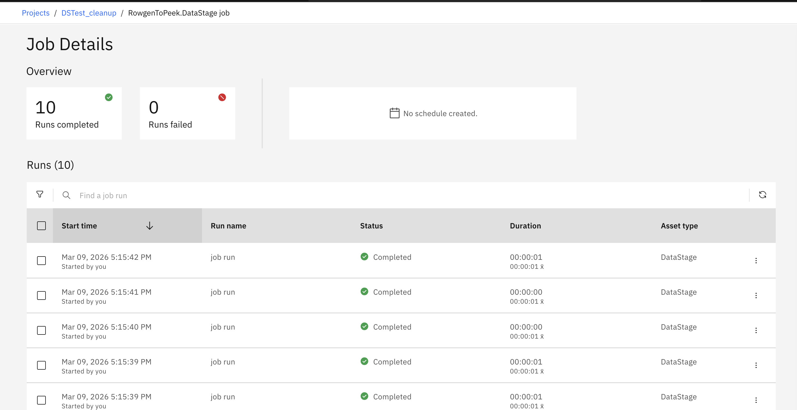
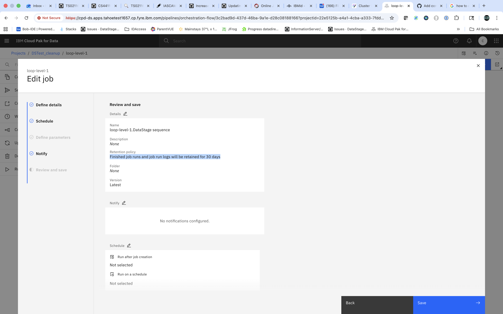
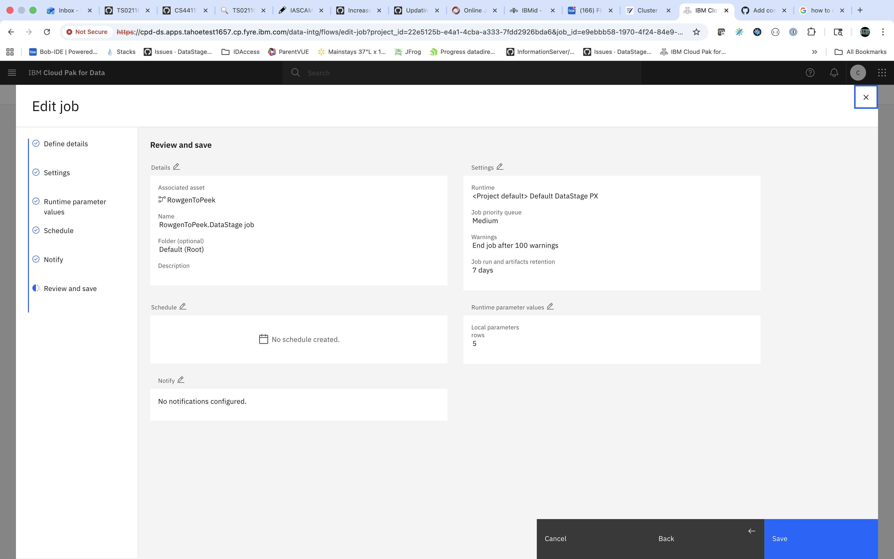
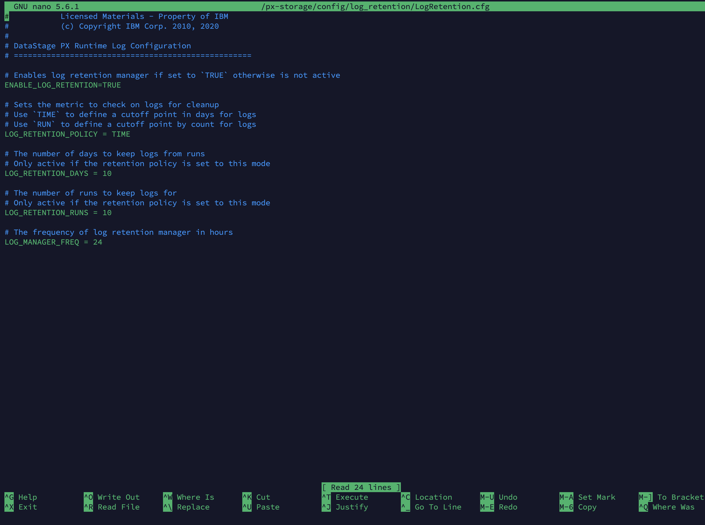

# DataStage Job Run Retention and Cleanup

To properly clean up job logs and manage job run retention in DataStage, follow these steps in order:

1. **Prune existing job runs** 
2. **Set retention policy for existing jobs**
3. **Update project default job run retention policy** for future jobs
4. **Storage cleanup** (optional)

## Step 1: Clean Up Existing Job Runs

Use the `listjobruns.sh` and `pruneJobs.sh` scripts to identify and remove old job runs from existing jobs. This process may take several hours depending on the number of runs in each job.

**Important:** Run these scripts during a maintenance window when no jobs are scheduled, as they may impact job run performance.

If there are jobs with more than 40,000 job runs, identify those jobs first using the `listjobruns.sh` script, then prune those high-volume jobs individually with `pruneJobs.sh` before pruning the entire project.

### Step 1.1: Identify Jobs with Large Run Histories

First, use the `listjobruns.sh` script to identify which jobs have accumulated large numbers of runs:

```bash
listjobruns.sh DSTest_cleanup
```

**Output:**
```
loop-level-1.DataStage sequence :0
loop-level-1.DataStage sequence job :16
RowgenToPeek.DataStage job :50000
```

In this example, "RowgenToPeek.DataStage job" has 50,000 runs and should be pruned first.

### Step 1.2: Prune Individual High-Volume Jobs

For jobs with a large number of runs (like the 50,000 runs identified above), prune them individually first. This example keeps only the last 10 runs:

```bash
pruneJobs.sh DSTest_cleanup --job "RowgenToPeek.DataStage job" --keep-runs 10
```

**Output:**
```
Found 1 jobs.
Pruning: RowgenToPeek.DataStage job
Executing: cpdctl dsjob prune -p "DSTest_cleanup" --name "RowgenToPeek.DataStage job" --keep-runs 10 
Found 1 jobs to process.
Successfully issued delete on RunID: 0b4ba52f-2244-4a6d-b6e5-b603b8c94524
Successfully issued delete on RunID: 36aefae5-8060-45bd-b3ab-70f5767e2105
Successfully issued delete on RunID: 07492c1f-3c65-4ef7-b51c-1abbe3a59913
...
Successfully completed processing Job: RowgenToPeek.DataStage job(e9ebbb58-1970-4f24-84e9-b7913f19c0cf)

Status code = 0

========= SUMMARY =========
Project        : DSTest_cleanup
Mode           : --keep-runs 10
Total Jobs     : 1
Successful     : 1
Failed         : 0
Retry Attempts : 0
===========================
```

### Step 1.3: Prune All Remaining Jobs in the Project

After handling high-volume jobs individually, prune all remaining jobs in the project. If threads are not specified, the default is 5.

```bash
pruneJobs.sh DSTest_cleanup --keep-runs 10
```

**Output:**
```
Found 23 jobs.
Pruning: loop-level-1.DataStage sequence job
Executing: cpdctl dsjob prune -p "DSTest_cleanup" --name "loop-level-1.DataStage sequence job" --keep-runs 10 
Found 1 jobs to process.
Successfully issued delete on RunID: 13d58dec-6042-42f9-b967-504b6b808978
Successfully issued delete on RunID: eb1915a5-3134-47e3-b63f-51386602d333
Successfully issued delete on RunID: 6db7aa28-f37b-4c28-8ca1-a40f4e13e0b7
...
Successfully completed processing Job: loop-level-1.DataStage sequence job(82f9a88c-aedb-4a59-ba05-adfb58a4bff4)

Status code = 0
...
Pruning: RowgenToPeek.DataStage job
Found 1 jobs to process.
Successfully issued delete on RunID: d13b3c4a-f05b-4bbf-98c0-5b30ab40f335
Successfully issued delete on RunID: 6ea2e4cd-ff04-467e-95f8-a6f885615fa6
Successfully issued delete on RunID: 7f8a0593-e74d-402f-a299-9c44c4daabca
Successfully issued delete on RunID: 77b47bd4-d0e0-4bde-b0dd-8895f43ec308
Successfully issued delete on RunID: f17097b0-3ff7-4c43-aa8d-f344feef148c
Successfully issued delete on RunID: 9e04e111-6821-4523-bdba-1a3fecd21fbf
Successfully issued delete on RunID: be6579a3-00e8-4a05-8fe2-a710086543f7
Successfully issued delete on RunID: 14282c1f-8841-452a-92ce-fa994365dfc9
Successfully issued delete on RunID: 3ea7a7c5-13c5-412f-87a7-1de5cfda5282
Successfully issued delete on RunID: af8d80a0-53db-4de2-89dc-c338a7f87341
Successfully issued delete on RunID: 0f6eb765-16d5-435b-8c88-2bc9d6e2ffb5
Successfully issued delete on RunID: 9d877436-3bd4-41cb-a2a7-bbf5d0ce6958
Successfully issued delete on RunID: 0495a9b7-857d-4bc0-b7b2-180d5fe8102c
Successfully issued delete on RunID: 3d4da4d1-f6f7-4fed-b1f2-e425fa4348f2
Successfully issued delete on RunID: bfb8da0a-2600-41c8-9ccd-b157e4bd7c78
Successfully issued delete on RunID: 5dba10f2-3555-496c-bcbc-461924002f6e
...
Successfully completed processing Job: RowgenToPeek.DataStage job(e9ebbb58-1970-4f24-84e9-b7913f19c0cf)

Status code = 0


========= SUMMARY =========
Project        : DSTest_cleanup
Mode           : --keep-runs 10
Total Jobs     : 23
Successful     : 23
Failed         : 0
Retry Attempts : 0
===========================
```

### After Cleanup

After running the cleanup scripts, the job runs are reduced:



For more options and usage, see the command reference below.

## Command Reference for pruneJobs.sh

### Command Syntax

```bash
pruneJobs.sh <PROJECT_NAME> --keep-runs <number> [OPTIONS]
pruneJobs.sh <PROJECT_NAME> --keep-days <number> [OPTIONS]
```

### Available Options

| Option | Description |
|--------|-------------|
| `--keep-runs <number>` | Number of most recent job runs to keep (mutually exclusive with `--keep-days`) |
| `--keep-days <number>` | Keep job runs from the last N days (mutually exclusive with `--keep-runs`) |
| `--job "<JOB_NAME>"` | Prune a specific job only (optional, mutually exclusive with `--input-file`) |
| `--input-file <file>` | File containing list of job names, one per line (optional, mutually exclusive with `--job`) |
| `--save-failures` | Save failed job names to `logs/failed_<PROJECT>_<timestamp>.txt` (optional) |
| `--threads <number>` | Number of parallel threads to use (default: 5, optional) |

### Usage Examples

**Prune all jobs in a project:**

```bash
pruneJobs.sh DSTest_cleanup --keep-runs 10 --threads 10
pruneJobs.sh DSTest_cleanup --keep-days 30 --threads 8
```

**Prune a single job:**

```bash
pruneJobs.sh DSTest_cleanup --job "RowgenToPeek.DataStage job" --keep-runs 5
pruneJobs.sh DSTest_cleanup --job "RowgenToPeek.DataStage job" --keep-days 7
```

**Prune multiple jobs from a file:**

```bash
pruneJobs.sh DSTest_cleanup --input-file jobs_list.txt --keep-runs 10
pruneJobs.sh DSTest_cleanup --input-file jobs_list.txt --keep-days 30
```

**Save failed jobs to a file:**

Failed jobs will be saved to `logs/failed_<PROJECT>_<timestamp>.txt`.

```bash
pruneJobs.sh DSTest_cleanup --keep-runs 10 --save-failures
```

**Retry failed jobs:**

You can use the failed job list from the above command and run the script on only the failed jobs:

```bash
pruneJobs.sh DSTest_cleanup --input-file logs/failed_<PROJECT>_<timestamp>.txt --keep-days 30
```

---

## Step 2: Set Retention Policy for Existing Jobs

If there are existing jobs in the project where retention policy is not set, or you want to modify the existing retention policy for all jobs in a project, use the [`jobRunHistoryRetention.sh`](./scripts/jobRunHistoryRetention.sh) script to configure retention policies.

### Example Scenario

Suppose in your project there are:
- Some jobs that do not have a retention policy set
- Some jobs that have a retention policy set to a different value (e.g., 30 days)
- You want to set the retention policy for all jobs to 7 days

**Job 1: Retention policy not set (None)**


**Job 2: Retention policy set to 30 days**



### Running the Script

```bash
jobRunHistoryRetention.sh DSTest_cleanup --days 7
```

**Output:**
```
Found 24 jobs.
Updating: Trial job - loop-level-2
Executing: cpdctl dsjob update-job -p "DSTest_cleanup" -n "Trial job - loop-level-2" --jobrun-retention-days 7
...

Status code = 0
Updating: loop_level_2.DataStage sequence job
Executing: cpdctl dsjob update-job -p "DSTest_cleanup" -n "loop_level_2.DataStage sequence job" --jobrun-retention-days 7
...

Status code = 0
Updating: RowgenToPeek.DataStage job
Executing: cpdctl dsjob update-job -p "DSTest_cleanup" -n "RowgenToPeek.DataStage job" --jobrun-retention-days 7
...

Status code = 0

========= SUMMARY =========
Project        : DSTest_cleanup
Retention Mode : 7 days
Total Jobs     : 24
Successful     : 24
Failed         : 0
Retry Attempts : 0
===========================
```

### Verify the Changes

After running the script, verify from the UI that the retention policy is set to 7 days for all jobs in the project. The last modified date will also be updated to confirm that the job was updated.

**Pipeline Job - After Update:**


**Parallel Job - After Update:**



## Command Reference for jobRunHistoryRetention.sh

### Command Syntax

```bash
jobRunHistoryRetention.sh <PROJECT_NAME> --runs <number> [OPTIONS]
jobRunHistoryRetention.sh <PROJECT_NAME> --days <number> [OPTIONS]
```

### Available Options

| Option | Description | Required | Mutually Exclusive With |
|--------|-------------|----------|------------------------|
| `--runs <number>` | Number of job runs to keep | Yes (or --days) | --days |
| `--days <number>` | Number of days to keep job runs | Yes (or --runs) | --runs |
| `--job "<JOB_NAME>"` | Apply to a specific job only | No | --input-file |
| `--input-file <file>` | File containing list of job names (one per line) | No | --job |
| `--save-failures` | Save failed job names to `logs/failed_<PROJECT>_<timestamp>.txt` | No | - |

### Usage Examples

**Set retention for all jobs in a project:**

```bash
jobRunHistoryRetention.sh MyProject --runs 10
jobRunHistoryRetention.sh MyProject --days 30
```

**Set retention for a single job:**

```bash
jobRunHistoryRetention.sh MyProject --job "ETL_Daily_Load.DataStage job" --runs 5
jobRunHistoryRetention.sh MyProject --job "SQ_Load.DataStage sequence" --days 7
```

**Set retention for multiple jobs from a file:**

```bash
jobRunHistoryRetention.sh MyProject --input-file jobs_list.txt --runs 10
jobRunHistoryRetention.sh MyProject --input-file jobs_list.txt --days 30
```

**Save failed jobs to a log file:**

```bash
jobRunHistoryRetention.sh MyProject --runs 10 --save-failures
jobRunHistoryRetention.sh MyProject --job "ETL_Daily_Load.DataStage job" --days 7 --save-failures
```

**Process jobs from file and save failures:**

```bash
jobRunHistoryRetention.sh MyProject --input-file jobs_list.txt --runs 5 --save-failures
```

---

## Step 3: Update Project Default Job Run Retention Policy

After setting retention policies for existing jobs, configure the default retention policy at the project level. This ensures that all newly created jobs automatically inherit this retention setting.

### Setting Project-Level Defaults

Navigate to your project settings in the DataStage UI and configure the default job run retention policy:


This setting will apply to all new jobs created in the project going forward.

---

## Step 4: Job Logs Storage on DataStage Runtime Instance

DataStage job logs are also stored at the px-runtime instance level in the `/ds-storage/<project-name>/job-runs/<job-id>/logs/` directory on the DataStage runtime instance. The Retention of these logs is controlled by `/px-storage/config/log_retention/LogRetention.cfg` file in the DataStage px-runtime instance. The default retention period for job logs is 10 days. 

Log into the DataStage px-runtime instance and navigate to `/px-storage/config/log_retention/LogRetention.cfg` file and edit the `log_retention_days` parameter to set the desired retention period for job logs.

oc rsh `<px-runtime-pod-name>`
 
nano  /px-storage/config/log_retention/LogRetention.cfg



---

## Best Practices

3. **Use appropriate thread counts:** Adjust the `--threads` parameter based on your system resources
4. **Monitor failed jobs:** Use the `--save-failures` option to track and retry failed operations

## Troubleshooting

### Common Issues

**Issue:** Pruning takes too long
- **Solution:** Reduce the number of threads or prune high-volume jobs individually first

**Issue:** Some jobs fail to prune
- **Solution:** Use the `--save-failures` option to capture failed jobs, then retry them individually

**Issue:** Job runs still visible on UI after pruning 
- **Solution:** Wait a few minutes for the UI to refresh, or check the job run history again

**Issue:** Retention policy not applying to some jobs
- **Solution:** project-level default retention policy is only applied to new jobs. For existing jobs, you must explicitly set the retention policy. 

---


