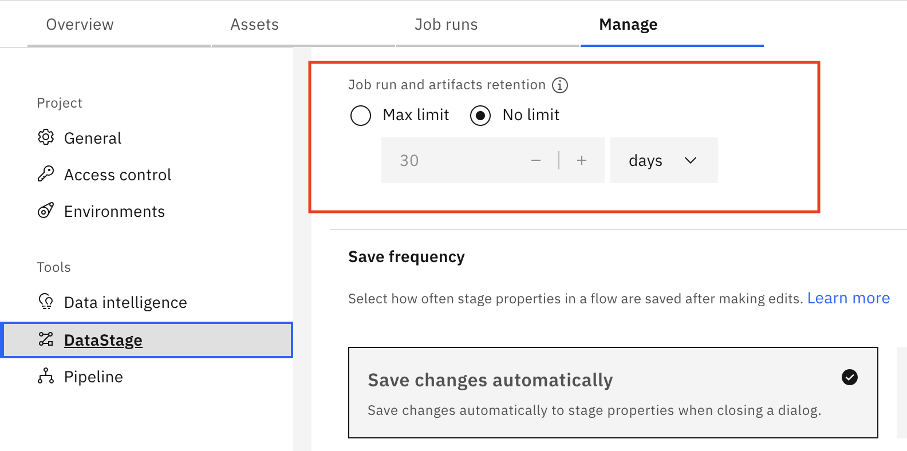

# DataStage Job Run Retention and Cleanup
## Overview

Job run logs and artifacts are stored in the `file-api-claim` PVC at the following location:

**Storage Path:** `/mnt/asset_file_api/projects/<PROJECT_ID>/assets/job_run/log` in `asset-files-api`

## Important Notes

- In DataStage versions **CPD5.3.1 and earlier**, the default project job run retention is set to **"No limit"**
- Changes to project default retention settings apply **only to newly created jobs**
- Existing jobs are **not affected** by default retention changes

## Recommended Cleanup Process

To properly manage job run retention in DataStage, follow these steps in this order:

1. **Prune existing job runs** using [`pruneJobs.sh`](./scripts/pruneJobs.sh)
2. **Set retention policy** for jobs using [`jobRunHistoryRetention.sh`](./scripts/jobRunHistoryRetention.sh)
3. **Update project default job run retention policy** to the desired value for future jobs. 

Let us follow the steps where a project has default retention policy for job run as "No Limit" and Found that large number of files exist under /mnt/asset_file_api/projects/<PROJECT_ID>/assets/job_run/log in asset-files-api pod.

Existing Project Setting:



## Setting Retention Policy

Use the [`jobRunHistoryRetention.sh`](./scripts/jobRunHistoryRetention.sh) script to configure retention policies.

**Prerequisites:** `cpdctl` must be configured before running the script.

### Command Syntax

```bash
jobRunHistoryRetention.sh <PROJECT_NAME> --runs <number> [OPTIONS]
jobRunHistoryRetention.sh <PROJECT_NAME> --days <number> [OPTIONS]
```

### Available Options

| Option | Description | Required | Mutually Exclusive With |
|--------|-------------|----------|------------------------|
| `--runs <number>` | Number of job runs to keep | Yes (or --days) | --days |
| `--days <number>` | Number of days to keep job runs | Yes (or --runs) | --runs |
| `--job "<JOB_NAME>"` | Apply to a specific job only | No | --input-file |
| `--input-file <file>` | File containing list of job names (one per line) | No | --job |
| `--save-failures` | Save failed job names to logs/failed_<PROJECT>_<timestamp>.txt | No | - |

### Usage Examples

**Set retention for all jobs in a project:**
```bash
jobRunHistoryRetention.sh MyProject --runs 10
jobRunHistoryRetention.sh MyProject --days 30
```

**Set retention for a single job:**
```bash
jobRunHistoryRetention.sh MyProject --job "ETL_Daily_Load.DataStage job" --runs 5
jobRunHistoryRetention.sh MyProject --job "SQ_Load.DataStage sequence" --days 7
```

**Set retention for multiple jobs from a file:**
```bash
jobRunHistoryRetention.sh MyProject --input-file jobs_list.txt --runs 10
jobRunHistoryRetention.sh MyProject --input-file jobs_list.txt --days 30
```

**Save failed jobs to a log file:**
```bash
jobRunHistoryRetention.sh MyProject --runs 10 --save-failures
jobRunHistoryRetention.sh MyProject --job "ETL_Daily_Load.DataStage job" --days 7 --save-failures
```

**Combine options:**
```bash
# Process jobs from file and save failures
jobRunHistoryRetention.sh MyProject --input-file jobs_list.txt --runs 5 --save-failures
```

### Script Features

- **Automatic retry:** Failed operations are retried up to 3 times
- **Failure tracking:** Use `--save-failures` to save failed job names to a log file in the `logs/` directory
- **Input file updates:** When using `--input-file`, the file is automatically updated with only failed jobs after execution

### When Retention Policy Takes Effect

The retention policy is triggered in the following scenarios:
- When a job is **created** with a retention policy
- When a job is **updated** with a retention policy
- When a job run is **patched** to a finished state

## Cleanup Existing Job Runs

Use the [`pruneJobs.sh`](./scripts/pruneJobs.sh) script to clean up existing job runs.

**Prerequisites:** `cpdctl` must be configured before running the script.

### Performance Enhancement

When `cpdctl` is configured with version **1.8.145 or later**, the script supports the `--threads` option for parallel job runs cleanup. Earlier versions only supported threading for jobs, not job runs.

### Command Syntax

```bash
pruneJobs.sh <PROJECT_NAME> --keep-runs <number> [OPTIONS]
pruneJobs.sh <PROJECT_NAME> --keep-days <number> [OPTIONS]
```

### Available Options

| Option | Description | Required | Mutually Exclusive With |
|--------|-------------|----------|------------------------|
| `--keep-runs <number>` | Number of most recent job runs to keep | Yes (or --keep-days) | --keep-days |
| `--keep-days <number>` | Keep job runs from the last N days | Yes (or --keep-runs) | --keep-runs |
| `--job "<JOB_NAME>"` | Prune a specific job only | No | --input-file |
| `--input-file <file>` | File containing list of job names (one per line) | No | --job |
| `--save-failures` | Save failed job names to logs/failed_<PROJECT>_<timestamp>.txt | No | - |

### Usage Examples

**Prune all jobs in a project:**
```bash
pruneJobs.sh MyProject --keep-runs 10
pruneJobs.sh MyProject --keep-days 30
```

**Prune a single job:**
```bash
pruneJobs.sh MyProject --job "ETL_Daily_Load" --keep-runs 5
pruneJobs.sh MyProject --job "Data_Transform" --keep-days 7
```

**Prune multiple jobs from a file:**
```bash
pruneJobs.sh MyProject --input-file jobs_list.txt --keep-runs 10
pruneJobs.sh MyProject --input-file jobs_list.txt --keep-days 30
```

**Save failed jobs to a log file:**
```bash
pruneJobs.sh MyProject --keep-runs 10 --save-failures
pruneJobs.sh MyProject --job "ETL_Job" --keep-days 7 --save-failures
```

**Combine options:**
```bash
# Process jobs from file and save failures
pruneJobs.sh MyProject --input-file jobs_list.txt --keep-runs 5 --save-failures
```

### Script Features

- **Automatic retry:** Failed operations are retried up to 3 times
- **Failure tracking:** Use `--save-failures` to save failed job names to a log file in the `logs/` directory
- **Input file updates:** When using `--input-file`, the file is automatically updated with only failed jobs after execution
- **Validation:** Ensures positive integer values for retention parameters

## Additional Resources

For more information and the latest scripts, visit the [IBM DataStage GitHub repository](https://github.com/IBM/DataStage/tree/main/dsjob/blogs).